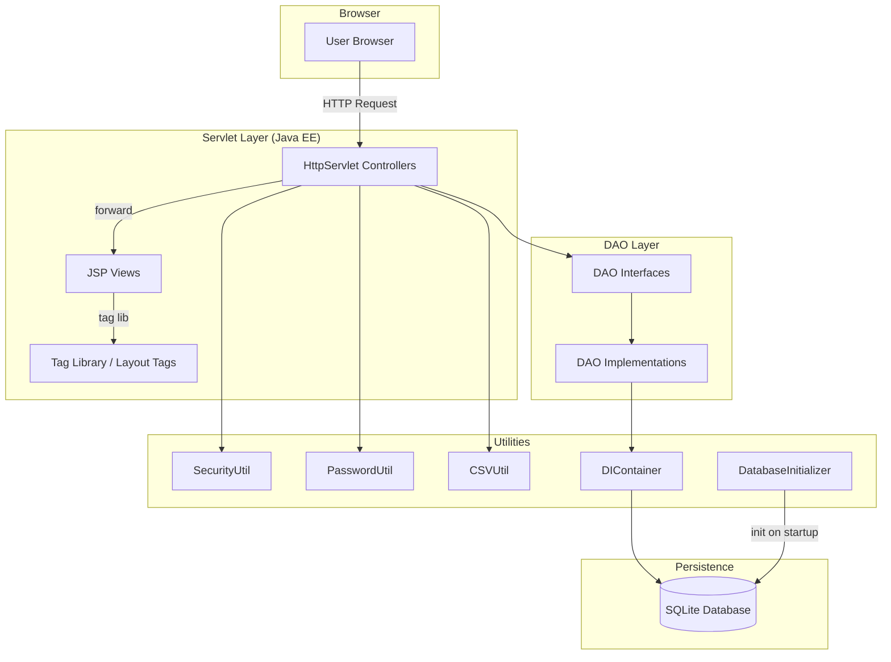
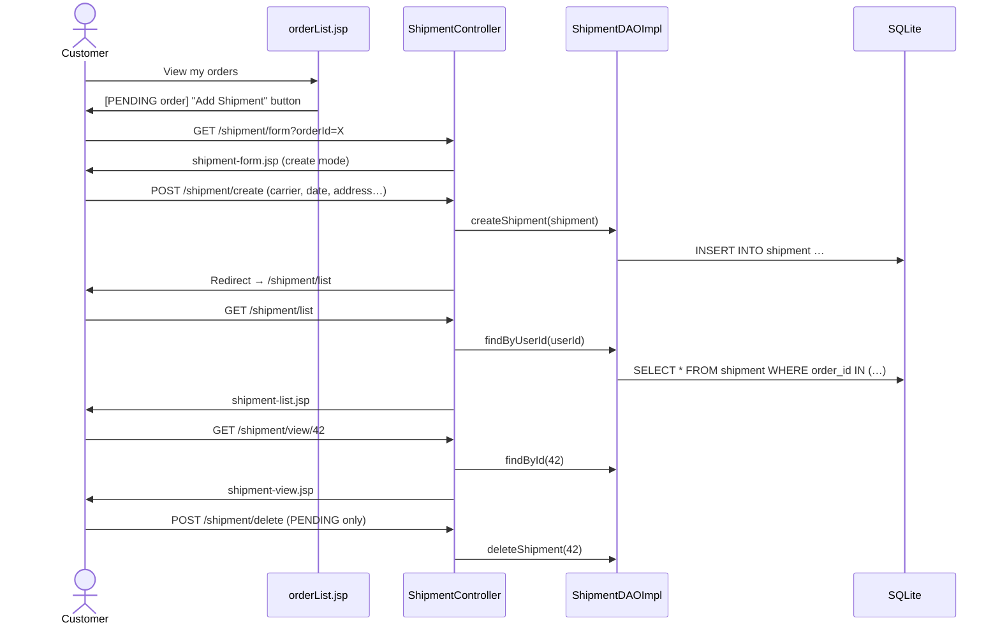
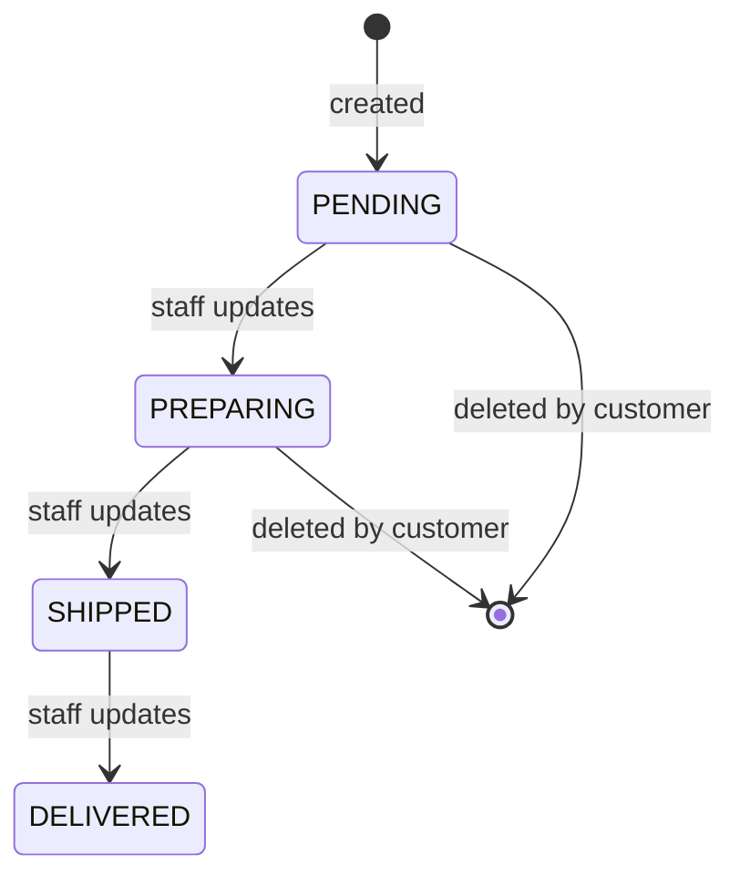
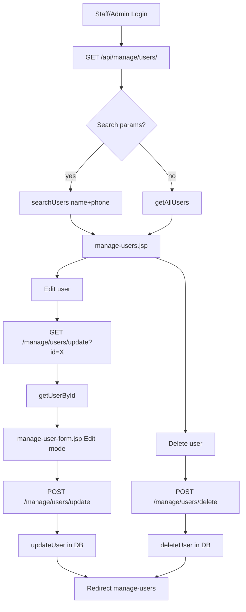
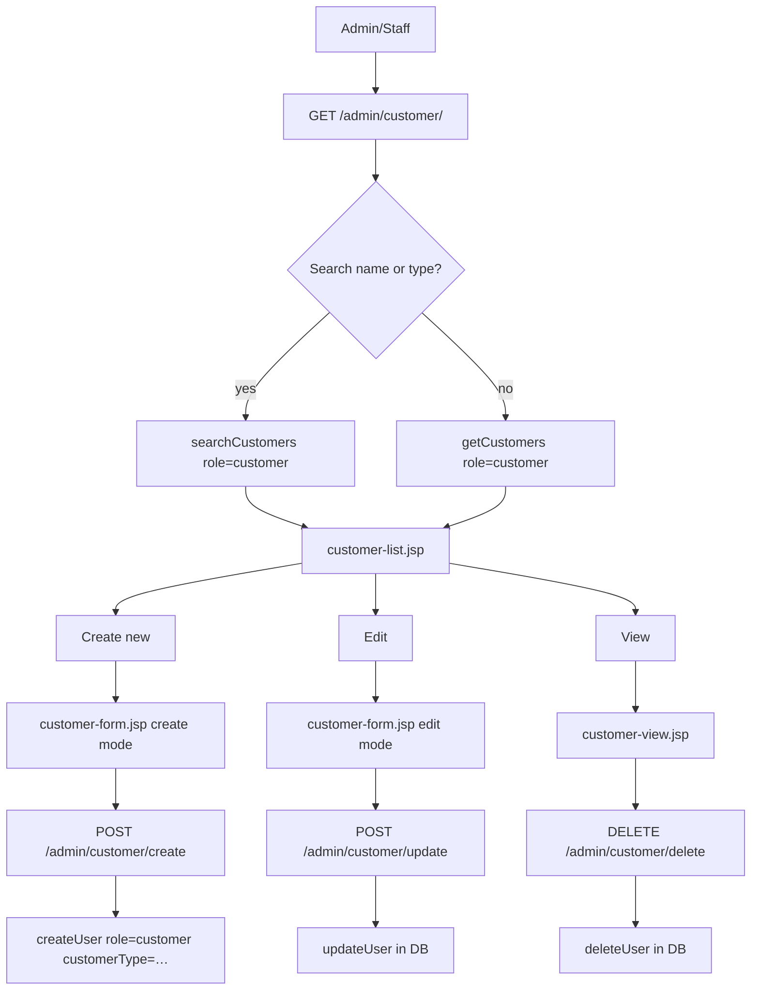
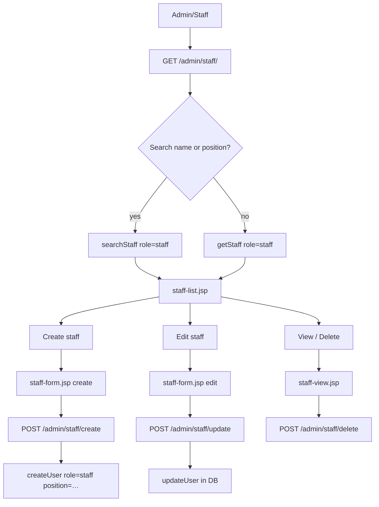
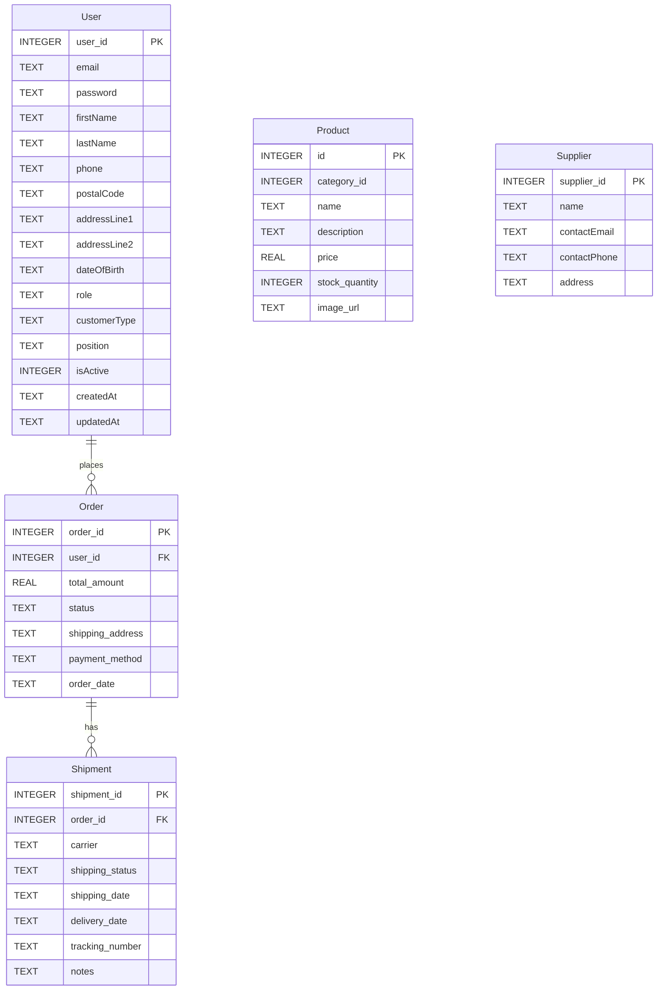

# IoTBay — Developer Guide

> UTS 41025 Internet Software Development — Assignment 2  
> Last updated: 2026-05-22

---

## Table of Contents
1. [System Architecture](#1-system-architecture)
2. [Technology Stack](#2-technology-stack)
3. [Project Structure](#3-project-structure)
4. [Feature Diagrams](#4-feature-diagrams)
   - [F05 — Shipment Management](#f05--shipment-management)
   - [F06 — User Management](#f06--user-management)
   - [F07 — Customer Management](#f07--customer-management)
   - [F08 — Staff Management](#f08--staff-management)
   - [F09 — Supplier Management](#f09--supplier-management)
   - [F10 — Data Management](#f10--data-management)
5. [Database Schema](#5-database-schema)
6. [Security Patterns](#6-security-patterns)
7. [Running Locally](#7-running-locally)

---

## 1. System Architecture



---

## 2. Technology Stack

| Layer | Technology |
|-------|-----------|
| Web Server | Eclipse Jetty 9 (via `jetty:run`) |
| Servlet API | Jakarta EE / `javax.servlet` |
| View | JSP + JSTL + Custom Tag Library (`<t:base>`) |
| CSS | Tailwind CSS (utility-first) |
| Database | SQLite (file-based, `iotbay.db`) |
| Build | Maven 3 |
| Java | Java 11+ |

---

## 3. Project Structure

```
src/main/
├── java/
│   ├── controller/          # Servlet controllers (one per feature)
│   ├── dao/
│   │   ├── interfaces/      # DAO contracts (UserDAO, ProductDAO, …)
│   │   └── *DAOImpl.java    # SQLite implementations
│   ├── model/               # POJOs (User, Product, Order, Shipment, …)
│   ├── config/
│   │   └── DIContainer.java # Simple DI + DB connection pool
│   └── utils/
│       ├── DatabaseInitializer.java
│       ├── SecurityUtil.java   # CSRF, sanitize, session checks
│       ├── PasswordUtil.java   # BCrypt hashing
│       ├── CSVUtil.java        # CSV parse / generate
│       └── ErrorAction.java    # Centralised error forwarding
└── webapp/
    ├── admin/               # Admin JSPs (customer, staff, supplier)
    ├── WEB-INF/
    │   ├── views/           # Main feature JSPs
    │   └── tags/layout/     # <t:base> layout tag
    └── assets/              # CSS / JS
```

---

## 4. Feature Diagrams

### F05 — Shipment Management

**URL pattern:** `/shipment/*`  
**Controller:** `ShipmentController`



**Status lifecycle:**



---

### F06 — User Management

**URL pattern:** `/api/manage/users/*`  
**Controllers:** `ManageUserController`, `UpdateUserController`, `DeleteUserController`



---

### F07 — Customer Management

**URL pattern:** `/admin/customer/*`  
**Controller:** `CustomerController`



**Customer Type field** is stored in `User.customerType` (`individual` / `company`).

---

### F08 — Staff Management

**URL pattern:** `/admin/staff/*`  
**Controller:** `StaffController`



**Position values:** `salesperson` | `manager` | `support` | `technician`  
Stored in `User.position` column.

---

### F09 — Supplier Management

**URL pattern:** `/admin/supplier/*`  *(fully implemented, no changes)*

```mermaid
flowchart LR
    A[Admin] --> B[/admin/supplier/]
    B --> C[supplier-list.jsp]
    C --> D[/admin/supplier/form] --> E[Create]
    C --> F[/admin/supplier/edit/id] --> G[Update]
    C --> H[/admin/supplier/delete] --> I[Delete]
```

---

### F10 — Data Management

**URL pattern:** `/api/dataManagement/*`  
**Controller:** `DataManagementController`

```mermaid
flowchart TD
    A[Admin/Staff] --> B[data-management.jsp]

    B --> C[Export]
    C --> D[GET /exportUsers] --> DA[users_export.csv]
    C --> E[GET /exportProducts] --> EA[products_export.csv]
    C --> F[GET /exportOrders] --> FA[orders_export.csv]
    C --> G[GET /exportAccessLogs] --> GA[access_logs_export.csv]

    B --> H[Import]
    H --> I[POST /import multipart CSV]
    I --> J{Valid headers?}
    J -- no  --> K[Error → data-management.jsp]
    J -- yes --> L[import-preview.jsp]
    L --> M[POST /confirmImport]
    M --> N[Bulk INSERT via UserDAO / ProductDAO]
    N --> O[Success message → dashboard]

    B --> P[Bulk Delete]
    P --> Q[POST /bulkDelete ids[]+deleteType]
    Q --> R[deleteUser / deleteProduct per ID]
    R --> O
```

**Supported import entity types:**

| entityType | Expected CSV Headers |
|------------|---------------------|
| `users` | Email, First Name, Last Name, Phone, Is Active |
| `products` | Name, Category, Price, Stock Quantity, Description |

---

## 5. Database Schema



---

## 6. Security Patterns

| Concern | Implementation |
|---------|---------------|
| CSRF | `SecurityUtil.generateCSRFToken(request)` on every form; `validateCSRFToken(request)` in every POST handler |
| XSS | `SecurityUtil.sanitizeInput()` on all user text input; JSP `<c:out>` for output |
| Auth check | `session.getAttribute("user")` instanceof `User` in every controller |
| Role check | `"admin".equalsIgnoreCase(role) \|\| "staff".equalsIgnoreCase(role)` |
| Password | BCrypt via `PasswordUtil.hashPassword()` and `PasswordUtil.verifyPassword()` |
| SQL injection | Parameterised `PreparedStatement` throughout all DAOs |

---

## 7. Running Locally

```bash
# Clone
git clone https://github.com/salieri009/IoTBay.git
cd IoTBay

# Build & run (Jetty embedded)
mvn jetty:run

# Access
open http://localhost:8080
```

Default test accounts (seeded by `DatabaseInitializer`):

| Role | Email | Password |
|------|-------|----------|
| Admin | admin@iotbay.com | admin123 |
| Staff | staff@iotbay.com | staff123 |
| Customer | customer@iotbay.com | customer123 |

---

*Generated for the IoTBay project — UTS 41025 ISD Assignment 2.*
