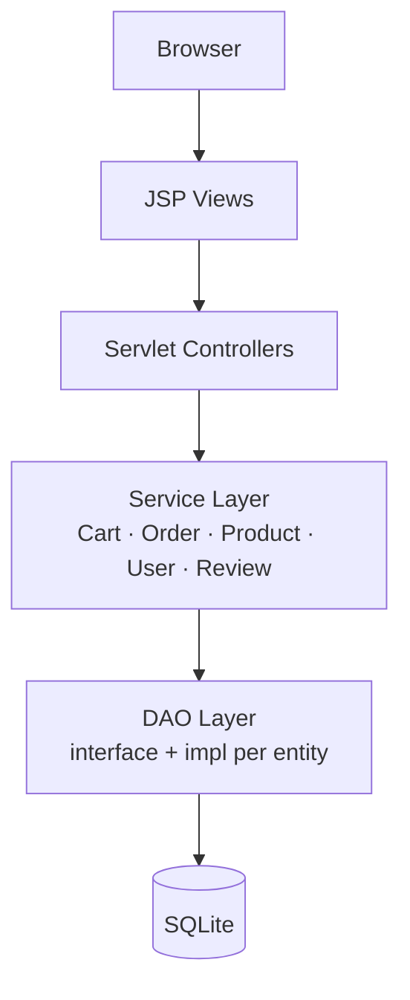

<div align="center">


# IoTBay

**Full-stack e-commerce platform for IoT devices**

[](https://github.com/salieri009/IoTBay/actions/workflows/ci.yml)
[](https://github.com/salieri009/IoTBay/actions/workflows/deploy.yml)
[](https://openjdk.org/projects/jdk/11/)
[](https://www.sqlite.org/)
[](https://ghcr.io/salieri009/iotbay)
[](src/test/java/e2e/)

Browse, purchase, and manage IoT devices — Smart Home, Industrial, Healthcare, and more.

[Quick Start](#quick-start) · [Features](#features) · [Tech Stack](#tech-stack) · [Docs](docs/)

</div>

---

## Features

<table>
<tr>
<td width="33%" valign="top">

**User & Auth**
- Registration with email validation
- SHA-256 salted password hashing
- Role-based access: Customer / Staff / Admin
- Session management & audit trail

</td>
<td width="33%" valign="top">

**Product Catalog**
- Full-text search with category, price & stock filters
- 6 product categories
- Paginated listing with sort controls

</td>
<td width="33%" valign="top">

**Shopping & Checkout**
- Persistent session cart
- Multi-step checkout with shipping options
- Payment history & order confirmation

</td>
</tr>
<tr>
<td width="33%" valign="top">

**Order Management**
- Full order lifecycle tracking
- Shipment creation & tracking numbers
- Customer order cancellation

</td>
<td width="33%" valign="top">

**Admin Dashboard**
- KPI overview — sales, users, products
- Product CRUD & user activation/deactivation
- Bulk data export (CSV & JSON)

</td>
<td width="33%" valign="top">

**Security**
- CSRF token validation
- SQL injection prevention (prepared statements)
- XSS output encoding
- Full access log

</td>
</tr>
</table>

---

## Quick Start

**Prerequisites:** Java 11+, Maven 3.6+

```bash
git clone https://github.com/salieri009/IoTBay.git
cd IoTBay
mvn jetty:run
```

Open [http://localhost:8080](http://localhost:8080).

```bash
# Run the full E2E test suite (server must be running)
mvn test
```

> **No Java?** Use Docker instead:
> ```bash
> docker compose up
> ```

---

## Tech Stack

<div align="center">

| Layer | Technology |
|---|---|
| **Backend** |   |
| **Database** |  |
| **Frontend** |   |
| **Server** | -00CED1) -F8DC75?logo=apachetomcat&logoColor=black) |
| **Testing** |   |
| **CI/CD** |   |

</div>

---

## Architecture



<details>
<summary>Domain model — 10 core entities</summary>

| Entity | Key Relationships |
|---|---|
| `User` | has many `Order`, `Review`, `CartItem`, `AccessLog` |
| `Product` | belongs to `Category`; has many `Review`, `OrderProduct` |
| `Order` | has many `OrderProduct`, one `Payment`, one `Shipment` |
| `CartItem` | links `User` → `Product` |
| `Review` | links `User` → `Product` |
| `Shipment` | belongs to `Order` |
| `Payment` | belongs to `Order` |
| `Supplier` | supplies `Product` |
| `AccessLog` | records every authenticated action |

</details>

<details>
<summary>Feature coverage — F01–F10 (118 E2E tests)</summary>

| ID | Feature | Tests |
|---|---|---|
| F01 | Access Log | 6 |
| F02 | Product Catalog | 10 |
| F03 | Order Management | 8 |
| F04 | Payment | 8 |
| F05 | Shipment | 12 |
| F06 | User Management | 10 |
| F07 | Customer Management | 12 |
| F08 | Staff Management | 12 |
| F09 | Supplier Management | 10 |
| F10 | Data Management (CSV/JSON) | 16 |
| — | Security Boundary Tests | 14 |
| **Total** | | **118** |

</details>

---

## Documentation

<details>
<summary>Full documentation index</summary>

| Section | Links |
|---|---|
| [Getting Started](docs/1_getting-started/) | [Project Overview](docs/1_getting-started/PROJECT_OVERVIEW.md) · [Quick Start](docs/1_getting-started/QUICKSTART.md) · [Setup Guide](docs/1_getting-started/SETUP_GUIDE.md) |
| [Architecture](docs/2_architecture/) | [Components](docs/2_architecture/COMPONENT_ARCHITECTURE.md) · [Database Design](docs/2_architecture/DATABASE_DESIGN.md) · [Security Architecture](docs/2_architecture/SECURITY_ARCHITECTURE.md) |
| [Requirements](docs/3_requirements/) | [Features](docs/3_requirements/FEATURES.md) · [User Stories](docs/3_requirements/USER_STORIES.md) · [API Reference](docs/3_requirements/API_REFERENCE.md) |
| [Development](docs/4_development/) | [Backend Guide](docs/4_development/BACKEND_GUIDE.md) · [Frontend Guide](docs/4_development/FRONTEND_GUIDE.md) · [Contributing](docs/4_development/CONTRIBUTING.md) |
| [Deployment](docs/4_development/deployment/) | [Docker Setup](docs/4_development/deployment/DOCKER_SETUP.md) · [Local](docs/4_development/deployment/LOCAL_DEPLOYMENT.md) · [Production](docs/4_development/deployment/PRODUCTION_DEPLOYMENT.md) |
| [Testing](docs/5_testing/) | [E2E Guide](docs/5_testing/E2E_TESTING.md) · [Test Strategy](docs/5_testing/TEST_STRATEGY.md) · [Test Data](docs/5_testing/TEST_DATA.md) |

</details>

---

<div align="center">
Java Servlets · JSP · SQLite · Tailwind CSS · Selenium WebDriver<br/>
297 commits · 8 contributors · 111 source files · 118 E2E tests

<sub>UTS 41025 Internet Software Development — Autumn 2025 (Semester 1, 2025)</sub>
</div>
