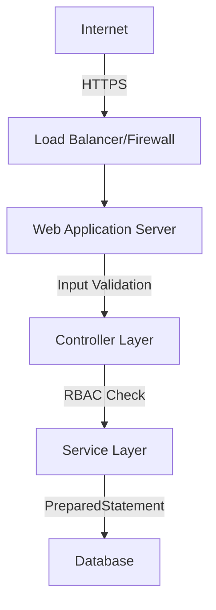

# Security Architecture

**Document Version**: 1.0.0  
**Status**: Published  
**Last Updated**: December 3, 2025  
**Audience**: Architects, Developers, Security Officers  
**Maintained By**: IoT Bay Documentation Team

---

## Overview

The IoT Bay security architecture implements a defense-in-depth strategy, securing the application at the network, application, and data layers.

## Core Security Mechanisms

### 1. Authentication & Authorization
- **Mechanism**: Session-based authentication with SHA-256 password hashing.
- **Access Control**: Role-Based Access Control (RBAC) distinguishing between `customer`, `staff`, and `admin` roles.
- **Implementation**: See [User Management Requirements](../3_requirements/FR-001-User-Management.md).

### 2. Data Protection
- **Encryption**: Sensitive data (passwords) is hashed. Payment data is not stored locally (simulated).
- **Validation**: Strict server-side input validation using `ValidationUtil`.
- **Details**: See [Security Features Requirements](../3_requirements/FR-007-Security-Features.md).

### 3. Application Security
- **CSRF Protection**: Token-based verification for state-changing requests.
- **SQL Injection**: Use of `PreparedStatement` for all database interactions.
- **XSS Prevention**: Output encoding and input sanitization.

## Security Layers

## Related Documentation

- [Security Requirements (FR-007)](../3_requirements/FR-007-Security-Features.md)
- [Backend Security Implementation](../4_development/BACKEND_GUIDE.md#security-best-practices)
- [Error Prevention](../5_testing/ERROR_PREVENTION.md)
